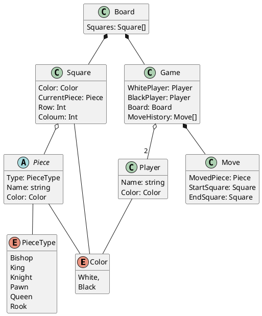

## Domain model

```plantuml
@startuml
hide empty members

enum Color {
  White,
  Black
}

enum PieceType {
    Bishop
    King
    Knight
    Pawn
    Queen 
    Rook   
}

abstract class Piece {
  Type: PieceType
  Name: string
  Color: Color
}

class Player {
  Name: string
  Color: Color
}

class Square {
  Color: Color
  CurrentPiece: Piece
  Row: Int
  Coloum: Int
}

class Move {
  MovedPiece: Piece
  StartSquare: Square
  EndSquare: Square
}

class Board {
   Squares: Square[]

}
Board *-- Square

class Game {
  WhitePlayer: Player
  BlackPlayer: Player
  Board: Board
  MoveHistory: Move[]
}
Game *-- Move
Game o-- "2" Player
Square o-- Piece
Board *-- Game
Piece -- PieceType
Square -- Color
Player -- Color
Piece -- Color

@enduml
```